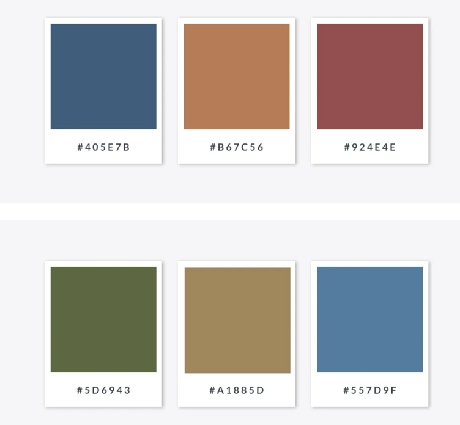
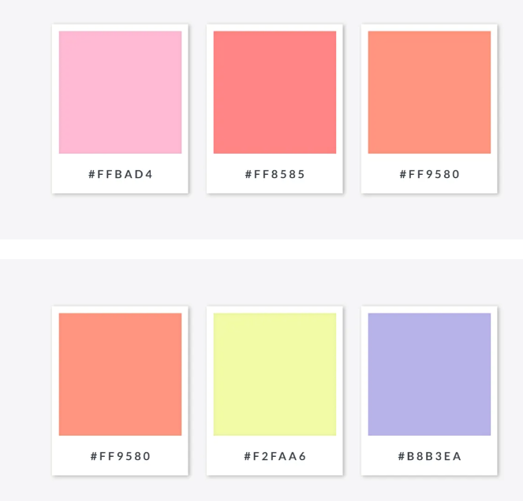
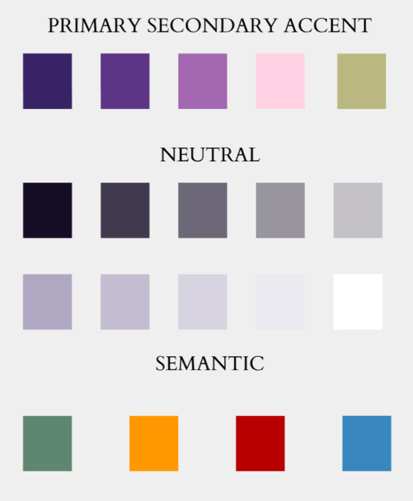
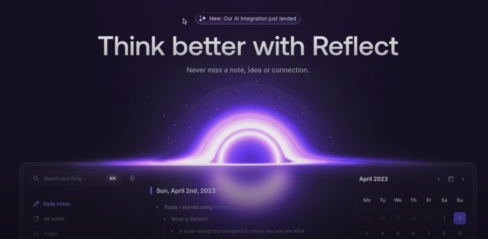

# The Design I will be using for this project

## Color scheme
1. **Analogous color**
>Analogous colors sit side by side on the color wheel. Using these colors together creates a soothing, serene feeling because the colors naturally match. Think of fall leaves: a rush of reds, oranges and yellows. To avoid putting your viewer to sleep, though, you can use black, white, or gray for contrast, or **add a complementary color** to your scheme. 

1. **Choosing Tonal range**
hue - the most saturated color
tints - white to hue
shades - black to hue
tones - gray to hue

Mid-tone color 
>Midway between light and dark.

it gives feeling of **elegant**, **not too loud** and **not too quiet**

Pastel color
>called "tints", pale version of saturated hue





```css
/* Colors */
:root{
    --primary-color: #382366;
    --secondary-color: #5D3587;
    --secondary-two-color: #A367B1;
    --secondary-three-color: #FFD1E3;
    --accent-color: #BBB780;

    --dark100:#150D26;
    --dark80: #150d26ce;
    --dark60:#150d269f;
    --dark40:#150d2664;
    --dark20:#150d2630;

    --light100: #B0A7C2;
    --light80: #C4BDD1;
    --light60: #D7D3E1;
    --light40: #EBE9F0;
    --light20: #FFFFFF;

    --positive: #5F8670;
    --warning: #FF9800;
    --error: #B80000;
    --informative: #3887BE;
}
```

## Typography
Typography (16px base size, 1.414 ratio)
1. Desktop 16
2. Tablet 14
3. Mobile 10

serif - Raleway
sans serif -  Cardo

p lineheight 1.3x letter-spacing none
others lineheight 1.1x letter-spacing 1-1.2

## Responsive
1. Default Remaining
2. Tablet >768px
3. Desktop >1024px

## Design trends
Will be trying to use aurora + glass


